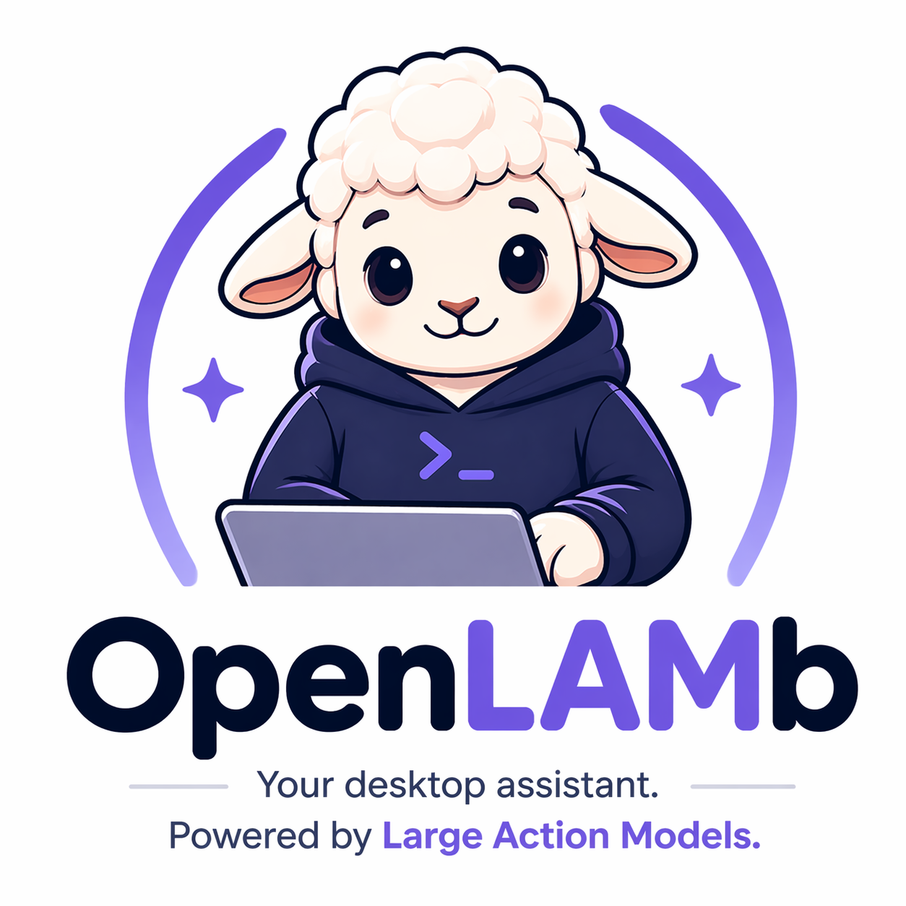

# OpenLAMb



**Your desktop assistant, powered by Large Action Models.**

OpenLAMb is a local-first Windows automation platform that turns natural-language goals into real desktop and web actions.
It combines governance controls, deterministic execution, teach mode recording, scheduling, and a commercial-style local password vault.

## Why OpenLAMb

- Works on standard Windows desktops (no VDI required)
- Plans and executes multi-step tasks from natural language
- UIA-first desktop control for installed apps
- Playwright-first web automation with guarded fallback behavior
- Human-in-the-loop safety: explicit control grant, pause/resume, risky action confirmations
- Local-first storage and processing for operational privacy

## Demo Prompts

- `open chatgpt app then click New chat then type "Daily summary" then press enter`
- `search Amazon for best price on Abu Garcia Voltiq baitcasting reel`
- `Search Indeed, LinkedIn, and other commercially available job sites for VP/AVP Data and AI roles in US and Ireland, then build a spreadsheet, report, and dashboard with links`
- `open linkedin app then login with linkedin`

## Commercial Feature Set (Current)

- Native planning and execution for complex requests
- Deterministic desktop sequencing (click/type/hotkey/wait/scroll/visual search)
- Installed app launcher with login checkpoint pause/resume
- Teach mode recorder with global hooks and event compression (`aggressive|normal|strict`)
- Visual selector picker (point-and-click capture)
- Schedule/trigger engine (interval, daily, event)
- Chat-style history recall with persistent local history
- Research artifact generation (CSV + Markdown + interactive HTML dashboard)
- Multi-backend AI mode selector in UI
- Local password vault (DPAPI-encrypted, no cloud sync)

## Local Password Vault

OpenLAMb includes a local-only credential service designed for practical daily use.

- DPAPI-backed encryption at rest (Windows user scope)
- Store `service + username + password + tags + favorites`
- Strong password generation with configurable strength inputs
- Encrypted backup/import (`.lamvault`)
- Safe autofill into active window (username -> tab -> password -> optional enter)
- Audit trail with redacted metadata only (`data/interface/vault_usage.jsonl`)

No vault data is sent to internet services by OpenLAMb.

## Quick Start

### 1) Install

```powershell
python -m venv .venv
.venv\Scripts\activate
pip install -e .
```

### 2) Optional runtime packages

```powershell
pip install pywinauto pynput pyautogui opencv-python pillow pytesseract
```

### 3) Run tests

```powershell
python -m unittest discover -s tests -p "test_*.py"
```

### 4) Start the UI

```powershell
python -m lam.main serve-ui --host 127.0.0.1 --port 8795
```

Open: `http://127.0.0.1:8795`

## Usability Walkthrough

See [Usability Guide](docs/USABILITY_GUIDE.md) for setup, workflows, and power-user patterns.

Highlights:

- Accept Control before any automation
- Use `Preview` for plan visibility before run
- Save automations and run them via schedules
- Use Teach Mode to capture repeatable work quickly
- Use the vault panel to securely manage and autofill credentials

## Architecture

- `lam/interface`: UI server, planner/executor routing, scheduler, teach recorder, vault
- `lam/adapters`: UIA, Playwright, Excel, Selenium adapter interfaces
- `lam/endpoint_agent`: workflow runner, pause/resume, kill switch
- `lam/governance`: policy engine, redaction, audit logger, secrets manager integration
- `lam/dsl`: schema/parser/validator
- `lam/services`: control-plane baseline services and durable stores
- `config`: allowlists, policy defaults
- `workflows`: workflow examples

## Security Notes

- Data directories are git-ignored by default (`data/`, `test_artifacts/`)
- Credential values are encrypted before persistence
- Password capture in teach paths is intentionally suppressed
- Risky actions are confirmation-gated

## Roadmap

- TOTP and secret rotation policies
- Team vault delegation with local policy constraints
- Richer UIA selector resilience and replay diagnostics
- Packaged Windows installer and signed release artifacts

## Documentation

- [Usability Guide](docs/USABILITY_GUIDE.md)
- [Commercial Features](docs/COMMERCIAL_FEATURES.md)
- [Control Plane API](docs/CONTROL_PLANE_API.md)
- [Ops Runbook](docs/OPS_RUNBOOK.md)
- [Commercial Readiness Checklist](docs/COMMERCIAL_READINESS_CHECKLIST.md)
