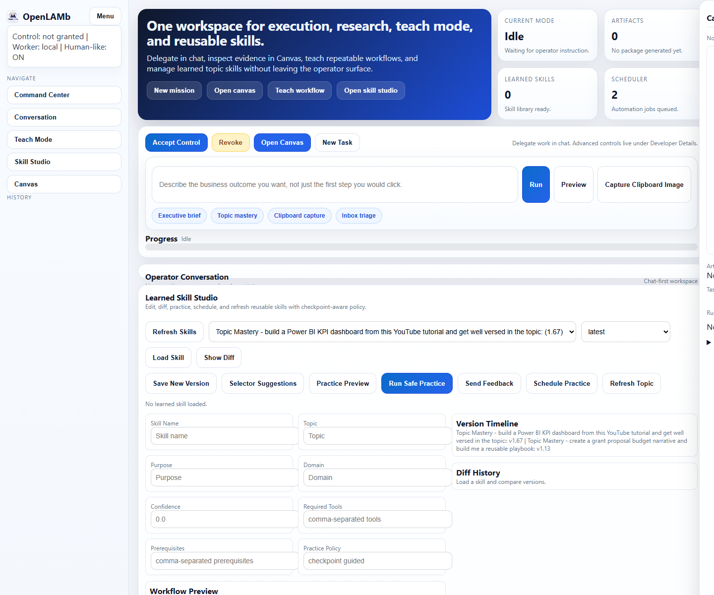
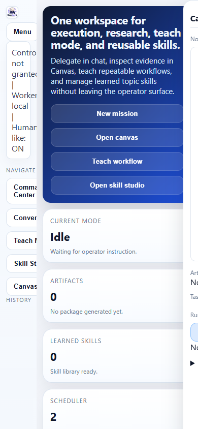

# OpenLAMb



OpenLAMb is a local-first digital operator for Windows.
It combines desktop automation, browser automation, teach mode, topic learning, mission-quality work products, governance controls, and reusable skills in one workspace.

It is built for work that is larger than a macro and more accountable than a blind agent run:
- run desktop and browser tasks from natural language
- build reports, spreadsheets, dashboards, briefs, and code workspaces
- teach repeatable workflows and replay them safely
- learn a topic from videos and sources, then save a reusable skill
- keep a local audit trail, approval path, and password vault

## Product Screens

### Command Center


### Mobile Layout


## Why OpenLAMb

OpenLAMb is designed around five product principles:

1. Local-first execution
   Browser and desktop work run on your machine, not a remote browser farm.
2. Human-governed automation
   Control grant, pause/resume, auth checkpoints, and risky-action gates are built in.
3. Real work products
   The system is expected to produce artifacts you can actually use: trackers, briefs, reports, dashboards, code workspaces, learned skills.
4. Reusable learning
   Teach Mode and Topic Mastery convert one-off work into reusable operator behavior.
5. Honest completion states
   OpenLAMb distinguishes real completion, partial completion, blocked states, and demo/template output.

## What It Can Do

### Digital operator
- UIA-first Windows desktop control
- Playwright-first web automation
- pause/resume around login or auth checkpoints
- saved automations and schedules
- clipboard capture and artifact packaging

### Professional work-product agent
- mission contract and evidence-aware execution
- executive briefs, reports, dashboards, trackers, and code workspaces
- critic and revision loops before final delivery
- truthful output classification

### Teach Mode
- record real workflows
- learn reusable recipe families
- adaptive replay with checkpoint-aware fallback
- branch health, timeline, re-teach guidance, and recipe families

### Topic Mastery Learn Mode
- learn from a topic or seed video URL
- discover related sources
- extract procedures and synthesize consensus workflows
- build reusable learned skills and mastery guides
- practice safely through checkpointed skill runtime

### Governance and operations
- local password vault with DPAPI encryption
- immutable-style audit chain validation
- authenticated control plane API
- policy-aware execution and risky-action confirmation

## Quick Start

### 1. Install

```powershell
python -m venv .venv
.venv\Scripts\activate
pip install -e .
```

### 2. Optional Windows automation/runtime packages

```powershell
pip install pywinauto pynput pyautogui opencv-python pillow pytesseract
```

### 3. Start the UI

Foreground:

```powershell
python -m lam.main ui
```

Detached background launch:

```powershell
python -m lam.main ui --background --port 8814
```

Then open:

```text
http://127.0.0.1:8795
```

### 4. Run a first task

Examples:

```text
open notepad app then type "OpenLAMb is live" then press enter
```

```text
Research the market for AI desktop agents and build an executive briefing with recommendations.
```

```text
Create a new VS Code workspace for this task, write analysis code, add smoke tests, and leave me a runnable scaffold.
```

## CLI Quick Reference

Global help:

```powershell
python -m lam.main --help
```

Start UI:

```powershell
python -m lam.main ui --help
```

Run Topic Mastery:

```powershell
python -m lam.main topic-learn --instruction "Learn how to build a Power BI KPI dashboard" --seed-url https://youtube.com/example --output json
```

List learned skills:

```powershell
python -m lam.main skill-list --output json
```

Preview safe practice:

```powershell
python -m lam.main skill-practice-preview --skill-id skill_power_bi_kpi_dashboard --output json
```

Run safe practice:

```powershell
python -m lam.main skill-practice-run --skill-id skill_power_bi_kpi_dashboard --output json
```

Refresh a learned skill:

```powershell
python -m lam.main skill-refresh --skill-id skill_power_bi_kpi_dashboard --version 1.0 --output json
```

## Product Workflows

### 1. Command Center
Use the main UI to:
- delegate a task in chat
- inspect progress in Operator Conversation
- open Canvas for artifacts and runtime context
- move into Skill Studio or Teach Mode when work should become reusable

### 2. Teach Mode
Use Teach Mode when you already know the task and want OpenLAMb to learn your workflow.

Typical flow:
1. Start Teach
2. perform the workflow
3. Stop and generate a learned recipe
4. preview replay
5. save and reuse the learned path

### 3. Topic Mastery Learn Mode
Use Topic Mastery when OpenLAMb needs to become well-versed in a topic before acting.

Typical flow:
1. provide a topic or seed video URL
2. let OpenLAMb discover related sources
3. review the mastery guide and learned skill
4. practice safely or refresh later as the topic changes

### 4. Skill Studio
Use Skill Studio to:
- inspect learned skills
- diff versions
- practice safely
- refresh topic-sensitive skills
- schedule practice

## Documentation Library

Start here:
- [Documentation Hub](docs/README.md)
- [Getting Started](docs/GETTING_STARTED.md)
- [UI Guide](docs/UI_GUIDE.md)
- [CLI Guide](docs/CLI_GUIDE.md)
- [Teach Mode Guide](docs/TEACH_MODE_GUIDE.md)
- [Topic Mastery Guide](docs/TOPIC_MASTERY_GUIDE.md)
- [Examples Library](docs/EXAMPLES.md)
- [Troubleshooting](docs/TROUBLESHOOTING.md)

Architecture and platform docs:
- [Operator Platform Architecture](docs/OPERATOR_PLATFORM_ARCHITECTURE.md)
- [Control Plane API](docs/CONTROL_PLANE_API.md)
- [Commercial Features](docs/COMMERCIAL_FEATURES.md)
- [Ops Runbook](docs/OPS_RUNBOOK.md)
- [Commercial Readiness Checklist](docs/COMMERCIAL_READINESS_CHECKLIST.md)

## Repository Map

- `lam/main.py`: CLI entry point
- `lam/interface/web_ui.py`: local chat/canvas UI server
- `lam/interface/search_agent.py`: main operator routing/orchestration
- `lam/interface/desktop_sequence.py`: deterministic desktop execution
- `lam/interface/teach_*`: Teach Mode runtime
- `lam/learn/*`: Topic Mastery Learn Mode and learned-skill runtime
- `lam/operator_platform/*`: mission, evidence, critics, revision, and capability graph layer
- `lam/services/*`: control plane, approval, and audit services
- `tests/unit/*`: unit and integration-oriented test coverage

## Safety Model

OpenLAMb is designed to avoid pretending that automation is safer than it is.

Built-in guardrails include:
- explicit control grant
- auth pause/resume
- risky-action confirmation
- local artifact routing
- local password vault
- checkpointed safe-practice runtime for learned skills
- audit validation and policy-aware execution

## Testing

Focused suite:

```powershell
python -m pytest -q tests\unit\test_main_cli.py tests\unit\test_password_vault.py tests\unit\test_web_ui_human_suite.py tests\unit\test_skill_library.py tests\unit\test_skill_runtime.py tests\unit\test_topic_mastery.py
```

Broader platform slice:

```powershell
python -m pytest -q tests\unit\test_search_agent.py tests\unit\test_operator_platform.py tests\unit\test_mission_runtime.py tests\unit\test_web_ui_human_suite.py
```

## Current Constraints

- Windows-first product surface
- some runtime capabilities depend on optional local tooling
- video/source quality in Topic Mastery depends on source accessibility and transcript availability
- desktop automation quality depends on target app structure and UI stability

These are product constraints, not hidden assumptions.

## Contributing

If you want to improve OpenLAMb, the fastest path is:
1. reproduce the issue through the UI or CLI
2. add or tighten a test
3. fix the behavior in the capability/runtime layer, not just prompt text
4. update the relevant guide in `docs/`

## License

OpenLAMb is licensed under the Business Source License 1.1.

- non-production, non-commercial use is permitted
- commercial use, production use, hosted service use, or redistribution for commercial gain requires a separate commercial license
- on February 25, 2030, the project changes to `GPL-2.0-or-later`

See [LICENSE](LICENSE) for the full terms.
