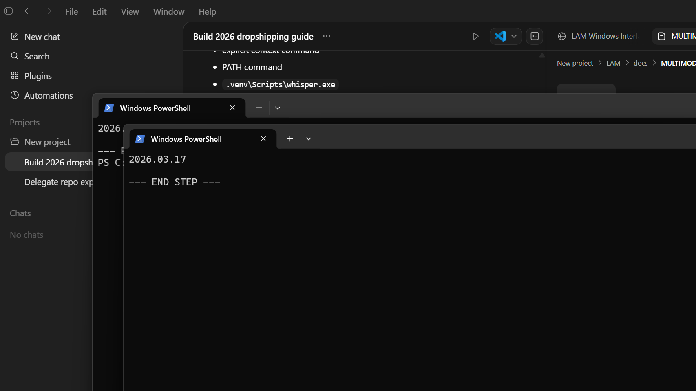
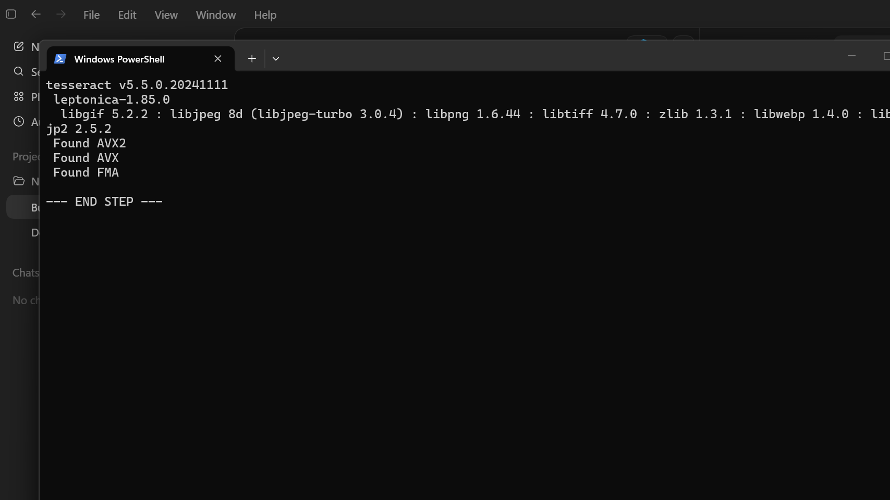
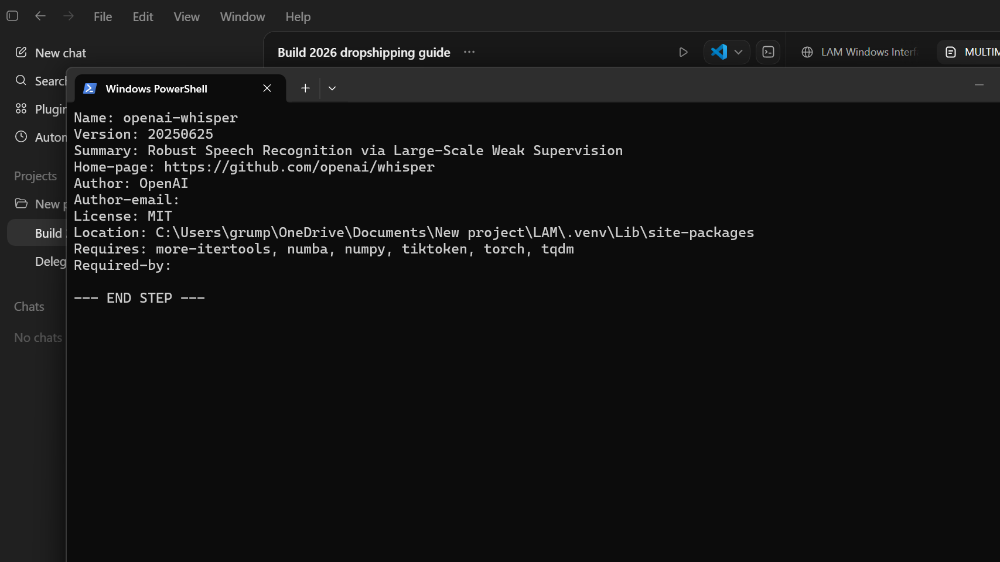
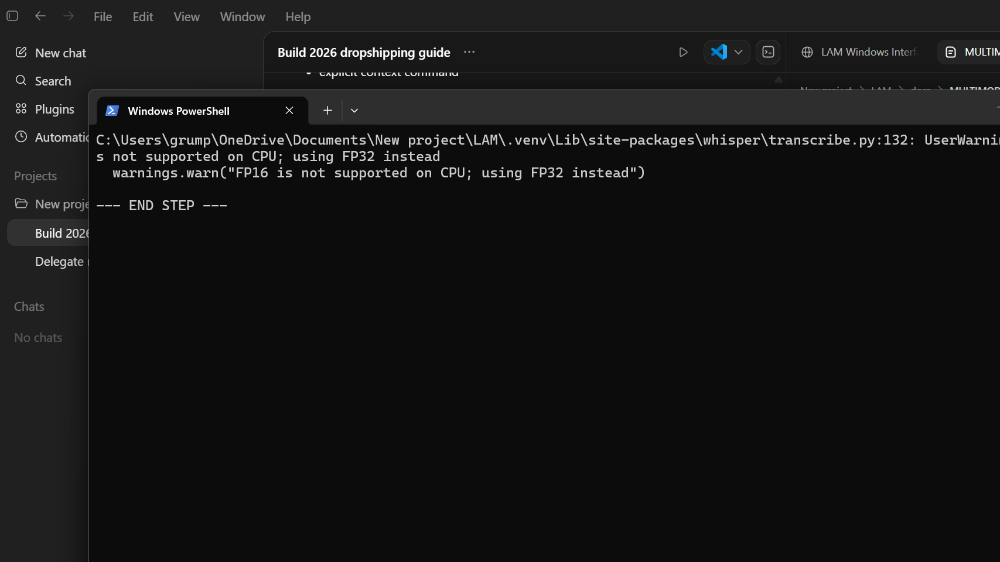
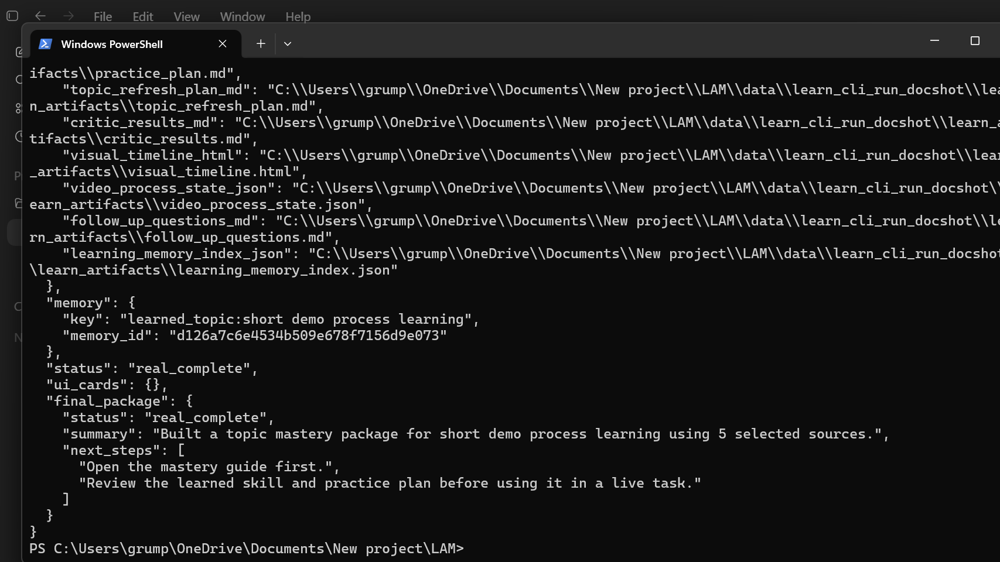
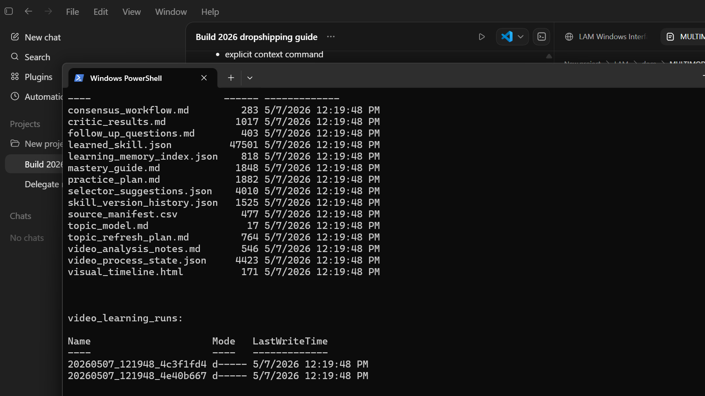
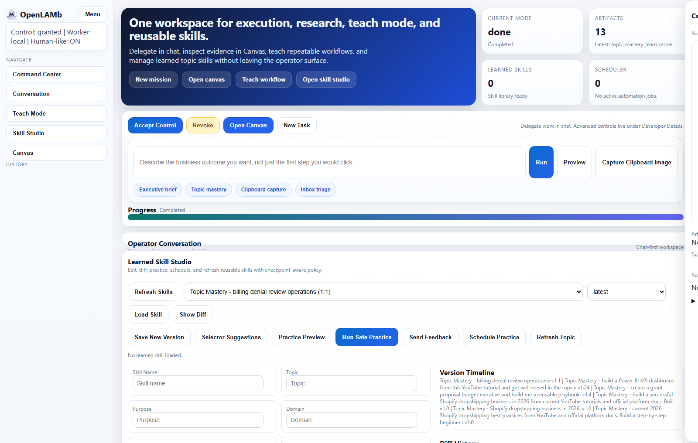

# Multimodal Video Learning Setup Guide

This guide shows how to install and enable commercial-quality video learning in OpenLAMb with:
- `yt-dlp` for direct video acquisition
- `tesseract` for frame OCR
- `whisper` for stronger transcription

Use this when you want OpenLAMb to learn reusable procedures from videos such as billing consolidation, denial review, or other operational workflows.
All screenshots below are real captures from this environment and stored in `docs/assets/multimodal-video-setup-real/`.

## Step 1: Install Required Tools

Run these commands from the repository root.

```powershell
# yt-dlp (already installed in this environment)
yt-dlp --version

# Tesseract OCR
winget install --id UB-Mannheim.TesseractOCR -e --accept-source-agreements --accept-package-agreements

# Whisper CLI (inside project venv)
.\.venv\Scripts\python.exe -m pip install openai-whisper
```



## Step 2: Verify Installations

Run verification:

```powershell
yt-dlp --version
C:\Program Files\Tesseract-OCR\tesseract.exe --version
.\.venv\Scripts\python.exe -m pip show openai-whisper
```

If `tesseract` is not found in a new shell, reopen PowerShell and retry. The installer path is:
- `C:\Program Files\Tesseract-OCR\tesseract.exe`




## Step 3: Run Whisper Smoke Test

Use a small local video first:

```powershell
.\.venv\Scripts\whisper.exe data\demo_short_video.mp4 --model tiny --language en --task transcribe --output_dir data\whisper_smoke --output_format txt
```

Expected behavior:
- first run downloads a model
- CPU fallback warning is normal on non-GPU systems
- transcript file is written to `data\whisper_smoke`



## Step 4: Run Topic Learning With Multimodal Processing

CLI example:

```powershell
.\.venv\Scripts\python.exe -m lam.main topic-learn --instruction "Learn billing denial review process and make it reusable" --topic "billing denial review operations" --workspace data\learn_cli_run --output json
```

Runtime knobs (via context/UI runtime config):
- `enable_whisper_cli=true`
- `enable_tesseract_ocr=true`
- `video_chunk_seconds=300` for long videos (smaller for short demos)
- `max_sampled_frames=80` or higher for denser visual grounding



## Step 5: Verify Learning Artifacts

After a run, check:
- `video_process_state.json`
- `follow_up_questions.md`
- `learning_memory_index.json`
- `video_analysis_notes.md`
- `mastery_guide.md`

These files confirm process-state awareness, dynamic follow-up learning, and persistent memory indexing.



## Step 6: Confirm UI Workflow

In the UI (`http://127.0.0.1:8814`):
1. Open `Command Center`
2. Grant control
3. Run your topic/video learning prompt
4. Open artifacts from the artifacts panel



## Behavior For Long Videos

OpenLAMb processes long videos in chunks and tracks phases:
1. ingestion started
2. metadata resolved
3. transcript extracted
4. visual signals extracted
5. chunk analysis complete
6. follow-up generated
7. memory persisted
8. complete

This allows interruption recovery, checkpoint visibility, and stronger iterative learning over many source videos.

## Troubleshooting

- `whisper` not found:
  - use `.\.venv\Scripts\whisper.exe` directly
  - or set `whisper_cmd` in runtime context
- `tesseract` not found:
  - verify `C:\Program Files\Tesseract-OCR\tesseract.exe`
  - or set `tesseract_cmd` in runtime context
- slow runs on CPU:
  - reduce `max_sampled_frames`
  - increase `video_chunk_seconds`
  - start with `--model tiny` for smoke validation
